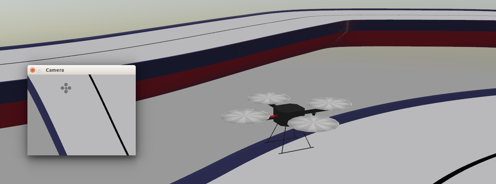

Репозиторий содержит программное обеспечение для
подготовки и сдачи квалификационного задания категории _Бакалавриат_  направления Робототехники олимпиады [Я - Профессионал](https://yandex.ru/profi/courses2020).

Данный репозиторий будет использоваться для проведения оценки заданий участников.

Предоставялемое программное обеспечение включает ROS-пакет, содержащий пример управления квадрокоптером и получения изображения с его бортовой камеры в симуляторе gazebo.

Работа с пакетом предполагается из docker-контейнера предоставляемого участникам в составе [основного репозитория олимпиады](https://gitlab.com/beerlab/iprofi2021/profi2021_robotics) и совместно с [репозиторием с описанием сцены и квадрокоптера для симулятора](https://gitlab.com/beerlab/iprofi2021/profi2021_bachelor_scene), соответственно, предоставляемые далее инструкции требуют предварительно выполнить инструкции, представленные в обозначенных репозиториях.

#### Установка программного обеспечения

1. В новом терминале **вне docker-контейнера** перейдите в корневую директорию основного репозитория олимпиады и склонируйте данный репозиторий в рабочее окружение выполнив:

        cd workspace/src
        git clone https://gitlab.com/beerlab/iprofi2021/profi2021_bachelor_solution.git

2. Откройте bash-сессию **внутри контейнера**, перейдите в смонтированное рабочее окружение и соберите все пакеты:

        bash docker/into_docker.sh
        cd /workspace
        catkin build

#### Описание программного обеспечения

1. Репозиторий представляет собой ROS-пакет, который участникам олимпиады предстоит использовать для представления своего решения для оценки. Пакет включает в себя пример управления квадрокоптером и получения изображения с его бортовой камеры.

2. Перед запуском примера убедитесь, что программное обеспечение из [репозитория с описанием сцены и квадрокоптера для симулятора](https://gitlab.com/beerlab/iprofi2021/profi2021_bachelor_scene) установленно корректно.

    Запустите симулятор выполнив:

        roslaunch profi2021_bachelor_scene start_scene.launch

    Дождитесь окончания загрузки симулятора и появления квадрокоптера на сцене. Для запуска примера в новой bash-сессии **внутри контейнера** выполните:

        roslaunch profi2021_bachelor_solution solution.launch

    При успешном выполнении всех выше обозначенных действий должно появиться дополнительное окно с выводом изображения с бортовой камеры квадрокоптера, сам квадрокоптер осуществит взлет на некоторую высоту и начнет исполнять траекторию в форме восьмерки:

    

    Исходный код примера находится в *scripts/simple_move.py* и представляет собой ROS-узел */quadrator_simple_move*. Узел подписывается на [топик с изображением */image*](https://docs.ros.org/en/melodic/api/sensor_msgs/html/msg/Image.html) с камеры робота, запускает двигатели квадрокоптера используя [сервис */enable_motors*](https://gitlab.com/beerlab/iprofi2021/profi2021_bachelor_scene/-/blob/master/hector_uav_msgs/srv/EnableMotors.srv) и публикует желаемую скорость робота в [топик */cmd_vel*](http://docs.ros.org/en/jade/api/geometry_msgs/html/msg/Twist.html). На рисунке ниже соответствующие топики и узлы представленны схематически:

    
